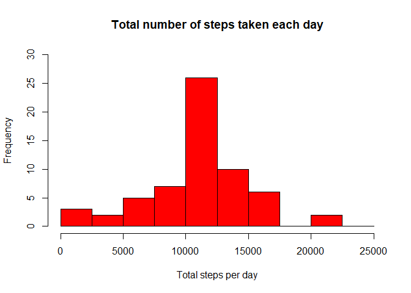

Loading and preprocessing the data
----------------------------------

#### Load the data (i.e. read.csv())

    activity <- read.csv("./activity.csv")

### Process/transform the data (if necessary) into a format suitable for your analysis

    activity$date <- as.POSIXct(activity$date, format = "%Y-%m-%d")
    weekday <- weekdays(activity$date)
    activity <- cbind(activity,weekday)
    summary(activity)

    ##      steps             date                        interval     
    ##  Min.   :  0.00   Min.   :2012-10-01 00:00:00   Min.   :   0.0  
    ##  1st Qu.:  0.00   1st Qu.:2012-10-16 00:00:00   1st Qu.: 588.8  
    ##  Median :  0.00   Median :2012-10-31 00:00:00   Median :1177.5  
    ##  Mean   : 37.38   Mean   :2012-10-30 23:32:27   Mean   :1177.5  
    ##  3rd Qu.: 12.00   3rd Qu.:2012-11-15 00:00:00   3rd Qu.:1766.2  
    ##  Max.   :806.00   Max.   :2012-11-30 00:00:00   Max.   :2355.0  
    ##  NA's   :2304                                                   
    ##       weekday    
    ##  domingo  :2304  
    ##  jueves   :2592  
    ##  lunes    :2592  
    ##  martes   :2592  
    ##  miércoles:2592  
    ##  sábado   :2304  
    ##  viernes  :2592

What is mean total number of steps taken per day?
-------------------------------------------------

### Calculate the total number of steps taken per day

    total_step_activity <- with(activity, aggregate(steps, by = list(date), FUN = sum, na.rm = TRUE))
    total_step_activity

    ##       Group.1     x
    ## 1  2012-10-01     0
    ## 2  2012-10-02   126
    ## 3  2012-10-03 11352
    ## 4  2012-10-04 12116
    ## 5  2012-10-05 13294
    ## 6  2012-10-06 15420
    ## 7  2012-10-07 11015
    ## 8  2012-10-08     0
    ## 9  2012-10-09 12811
    ## 10 2012-10-10  9900
    ## 11 2012-10-11 10304
    ## 12 2012-10-12 17382
    ## 13 2012-10-13 12426
    ## 14 2012-10-14 15098
    ## 15 2012-10-15 10139
    ## 16 2012-10-16 15084
    ## 17 2012-10-17 13452
    ## 18 2012-10-18 10056
    ## 19 2012-10-19 11829
    ## 20 2012-10-20 10395
    ## 21 2012-10-21  8821
    ## 22 2012-10-22 13460
    ## 23 2012-10-23  8918
    ## 24 2012-10-24  8355
    ## 25 2012-10-25  2492
    ## 26 2012-10-26  6778
    ## 27 2012-10-27 10119
    ## 28 2012-10-28 11458
    ## 29 2012-10-29  5018
    ## 30 2012-10-30  9819
    ## 31 2012-10-31 15414
    ## 32 2012-11-01     0
    ## 33 2012-11-02 10600
    ## 34 2012-11-03 10571
    ## 35 2012-11-04     0
    ## 36 2012-11-05 10439
    ## 37 2012-11-06  8334
    ## 38 2012-11-07 12883
    ## 39 2012-11-08  3219
    ## 40 2012-11-09     0
    ## 41 2012-11-10     0
    ## 42 2012-11-11 12608
    ## 43 2012-11-12 10765
    ## 44 2012-11-13  7336
    ## 45 2012-11-14     0
    ## 46 2012-11-15    41
    ## 47 2012-11-16  5441
    ## 48 2012-11-17 14339
    ## 49 2012-11-18 15110
    ## 50 2012-11-19  8841
    ## 51 2012-11-20  4472
    ## 52 2012-11-21 12787
    ## 53 2012-11-22 20427
    ## 54 2012-11-23 21194
    ## 55 2012-11-24 14478
    ## 56 2012-11-25 11834
    ## 57 2012-11-26 11162
    ## 58 2012-11-27 13646
    ## 59 2012-11-28 10183
    ## 60 2012-11-29  7047
    ## 61 2012-11-30     0

### If you do not understand the difference between a histogram and a barplot, research the difference between them. Make a histogram of the total number of steps taken each day

    names(total_step_activity) <- c("date", "steps")
    hist(total_step_activity$steps, main = "Total number of steps taken per day", xlab = "Total steps taken per day", col = "red", ylim = c(0,20), breaks = seq(0,25000, by = 2500))

### Calculate and report the mean and median of the total number of steps taken per day

    ### Mean 
    mean(total_step_activity$steps)

    ## [1] 9354.23

    ### Median 
    median(total_step_activity$steps)

    ## [1] 10395

What is the average daily activity pattern?
-------------------------------------------

### Make a time series plot (i.e.type=“l”) of the 5-minute interval (x-axis) and the average number of steps taken, averaged across all days (y-axis)

    average_daily_activity <- aggregate(activity$steps, by = list(activity$interval), FUN = mean, na.rm = TRUE)
    names(average_daily_activity) <- c("interval", "mean")
    plot(average_daily_activity$interval, average_daily_activity$mean, type = "l", col="red", lwd = 2, xlab="Interval", ylab="Average number of steps", main="Average number of steps per intervals")

### Interval with maximun number of steps

    average_daily_activity[which.max(average_daily_activity$mean), ]$interval

    ## [1] 835

Imputing missing values
-----------------------

### Calculate and report the total number of missing values in the dataset (i.e. the total number of rows with NAs)

    sum(is.na(activity$steps))

    ## [1] 2304

### Devise a strategy for filling in all of the missing values in the dataset. The strategy does not need to be sophisticated. For example, you could use the mean/median for that day, or the mean for that 5-minute interval, etc.

    imputed_steps <- average_daily_activity$mean[match(activity$interval, average_daily_activity$interval)]

### Create a new dataset that is equal to the original dataset but with the missing data filled in.

    imputed_activity <- transform(activity, steps = ifelse(is.na(activity$steps), yes = imputed_steps, no = activity$steps))
    total_steps_imputed <- aggregate(steps ~ date, imputed_activity, sum)
    names(total_steps_imputed) <- c("date", "daily_steps")

    hist(total_steps_imputed$daily_steps, col = "red", xlab = "Total steps per day", ylim = c(0,30), main = "Total number of steps taken each day", breaks = seq(0,25000,by=2500))

### Mean of the total number of steps taken per day

    mean(total_steps_imputed$daily_steps)

    ## [1] 10766.19

### Median of the total steps taken per day

    median(total_steps_imputed$daily_steps)

    ## [1] 10766.19

Are there differences in activity patterns between weekdays and weekends?
-------------------------------------------------------------------------

### Create a new factor variable in the dataset with two levels – “weekday” and “weekend” indicating whether a given date is a weekday or weekend day.

    require(ggplot2)

    ## Loading required package: ggplot2

    activity$date <- as.Date(strptime(activity$date, format="%Y-%m-%d"))
    activity$datetype <- sapply(activity$date, function(x) {
            if (weekdays(x) == "sábado" | weekdays(x) =="domingo") 
                    {y <- "Weekend"} else 
                    {y <- "Weekday"}
                    y
            })

### Make a panel plot containing a time series plot (i.e.type=“l”) of the 5-minute interval (x-axis) and the average number of steps taken, averaged across all weekday days or weekend days (y-axis). See the README file in the GitHub repository to see an example of what this plot should look like using simulated data.

    activity_by_date <- aggregate(steps~interval + datetype, activity, mean, na.rm = TRUE)
    plot<- ggplot(activity_by_date, aes(x = interval , y = steps, color = datetype)) +
           geom_line() +
           labs(title = "Average daily steps by type of date", x = "Interval", y = "Average number of steps") +
           facet_wrap(~datetype, ncol = 1, nrow=2)
    print(plot)

Note that the `echo = FALSE` parameter was added to the code chunk to
prevent printing of the R code that generated the plot.
